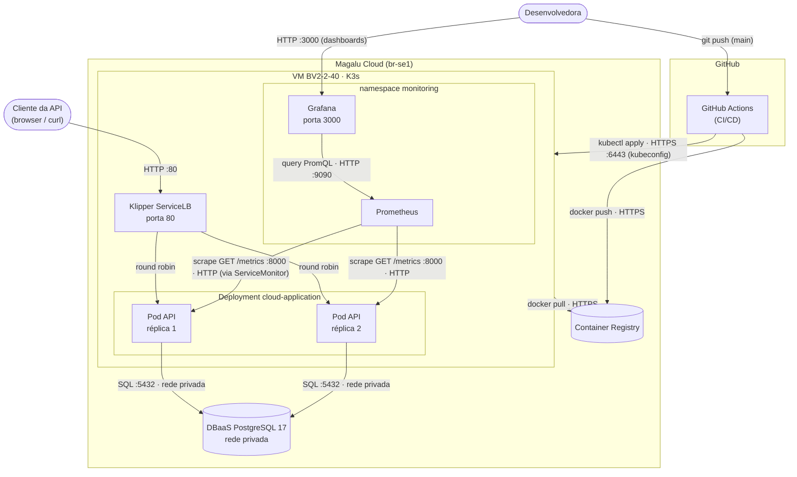

# Arquitetura da solução

## Diagrama de containers (nível C2)

## Componentes

| Componente | Serviço MGC | Função |
|---|---|---|
| API | K3s (VM single node) — 2 réplicas | Processa as requisições HTTP (`FastAPI`) |
| Banco de dados | DBaaS PostgreSQL 17 | Persiste pedidos e itens, rede privada |
| Imagens | Container Registry | Armazena as versões da aplicação (tag = SHA do commit) |
| Tráfego externo | Klipper ServiceLB (IP da VM, porta 80) | Distribui entre as réplicas e expõe acesso externo |
| CI/CD | GitHub Actions | Automatiza testes, build e deploy |
| Monitoramento | Prometheus + Grafana (Helm, namespace `monitoring`) | Coleta `/metrics` via `ServiceMonitor` e exibe em dashboards |

> O roteiro original desta competência lista só os 5 primeiros componentes — o
> monitoramento foi acrescentado aqui porque é parte real do que está em produção desde
> a Competência 5, e um diagrama de arquitetura que omite o que existe de fato deixa de
> cumprir sua própria função.

## Requisitos não-funcionais

Um diagrama sem número parece sempre suficiente. "Rápido" e "disponível" não são
requisitos — são adjetivos. Os alvos abaixo são o que torna a arquitetura verificável:

| Requisito | Como medir | Alvo |
|---|---|---|
| Disponibilidade | Erros 5xx e uptime das probes, no Grafana | 99,5% mensal |
| Latência | `histogram_quantile(0.95, ...)` sobre `/metrics` | P95 < 500 ms |
| Escalabilidade | Teste de carga (k6) + `rate(http_requests_total[5m])` | 300 req/s sem degradar |
| Custo | VM + DBaaS + IP, na calculadora da MGC | Ver tabela de "Custo estimado", abaixo |

Nenhum desses alvos foi validado sob carga real ainda — ver "Testes de carga" nos
pontos de melhoria, abaixo. Eles existem como **critério de aceite**, não como medição
já feita: é o que separa "deve dar conta" de "dá conta, e sabemos como checar".

## Estilo arquitetural

**Monolito em camadas** (apresentação → serviço → dados), implantado como um único
container, replicado horizontalmente (2 réplicas idênticas atrás do load balancer). Não
há fronteira de serviço dentro da aplicação — pedidos, itens e a própria observabilidade
vivem no mesmo processo FastAPI, compartilhando o mesmo deploy e o mesmo ciclo de vida.

Isso é uma escolha correta pro tamanho atual do domínio: menos partes móveis, deploy
mais simples, sem custo de rede entre serviços internos. O **estilo-alvo** — pra onde a
arquitetura evoluiria se um novo domínio (por exemplo, notificações: e-mail/push quando
um pedido muda de status) crescesse a ponto de ter ciclo de release e requisitos de
escala próprios — seria extrair um segundo serviço, com seu próprio deploy e banco (ou
schema), comunicando-se com a API principal por fila ou HTTP. Não faz sentido fazer essa
extração antes de o domínio pedir por ela — é o tipo de decisão que YAGNI cobre.

## Trade-offs

Toda decisão de arquitetura troca um benefício por outro — a tabela abaixo é o
registro consciente dessa troca (o raciocínio completo de cada linha marcada com ADR
está nos documentos correspondentes, em `docs/adr/`):

| Aspecto | Decisão tomada | Alternativa não escolhida | Motivo da escolha |
|---|---|---|---|
| Deploy | K3s em VM ([ADR 001](adr/001-kubernetes-deploy.md)) | MKS (Kubernetes gerenciado) | Custo menor, provisionamento < 2 min, manifests idênticos a qualquer K8s |
| Banco | DBaaS gerenciado ([ADR 002](adr/002-dbaas-postgresql.md)) | PostgreSQL em container | Backup automático, sem administração manual do banco |
| CI/CD | GitHub Actions | Deploy manual | Consistência e rastreabilidade — todo deploy tem log e autor |
| Réplicas | 2 pods | 1 pod | Disponibilidade mínima sem custo excessivo |
| API | FastAPI (Python) | Node.js, Go, Java | Curva de aprendizado baixa, alta produtividade |

## Pontos de melhoria

**Escalabilidade.** A aplicação é *stateless* (não guarda estado em memória entre
requisições — todo estado vive no PostgreSQL), então escala na horizontal: basta mais
réplicas atrás do load balancer. Hoje são 2 réplicas fixas; o próximo passo natural é o
**HPA** (Horizontal Pod Autoscaler), que ajusta esse número automaticamente pela
utilização de CPU (ex.: mínimo 2, máximo 6, alvo 70%). Importante registrar o limite
disso: mais réplicas de API não resolvem um gargalo no banco — o PostgreSQL escala na
**vertical** (mais CPU/RAM na mesma instância), e é ele quem tende a saturar primeiro
num pico de tráfego, não a API.

| Melhoria | Por quê |
|---|---|
| HTTPS / TLS | Toda API em produção deve ser acessada por HTTPS |
| Autoscaler (HPA) | Escala automaticamente conforme a carga |
| Versionamento de API (`/v1/orders`) | Permite evoluir o contrato sem quebrar clientes |
| Rate limiting | Evita abuso e protege o banco de sobrecarga |
| Cache (Redis) | Reduz consultas repetidas ao banco |
| Migrações de schema (Alembic) | Controle de versão das mudanças no banco |
| Testes de carga (k6) | Valida se os alvos da tabela de NFRs realmente se sustentam |
| Migrar para MKS | Quando precisar de HA real — os manifests YAML já são idênticos |

## Custo estimado na Magalu Cloud

| Recurso | Especificação | Observação |
|---|---|---|
| VM K3s | BV2-2-40 (2 vCPU, 2 GB) | Cobrada por hora de uso |
| DBaaS PostgreSQL | Instância pequena | Cobrada por hora de uso |
| Container Registry | Por armazenamento | Baixo para imagens < 500 MB |

Preços atualizados: [magalu.cloud/precos](https://magalu.cloud/precos/)

> **Nota de capacidade (achado real, Competência 5):** os 2 GB de RAM da VM `BV2-2-40`
> já ficam no limite só com o K3s (~750 MB) e a aplicação. Ao instalar o
> `kube-prometheus-stack` completo (Prometheus + Grafana + Alertmanager) por cima, a VM
> entrou em thrashing (load average > 40, API do cluster inacessível) — não por erro de
> configuração, mas porque a soma do que estava rodando excedia a memória física
> disponível. Isso é o trade-off de custo se manifestando na prática: a VM mais barata
> tem um teto de capacidade real, e observabilidade tem custo de recursos, não só de
> licença. Ver `docs/evidencias-comp5.md`, seção 3.

[↑ Voltar ao topo](#arquitetura-da-solução)
