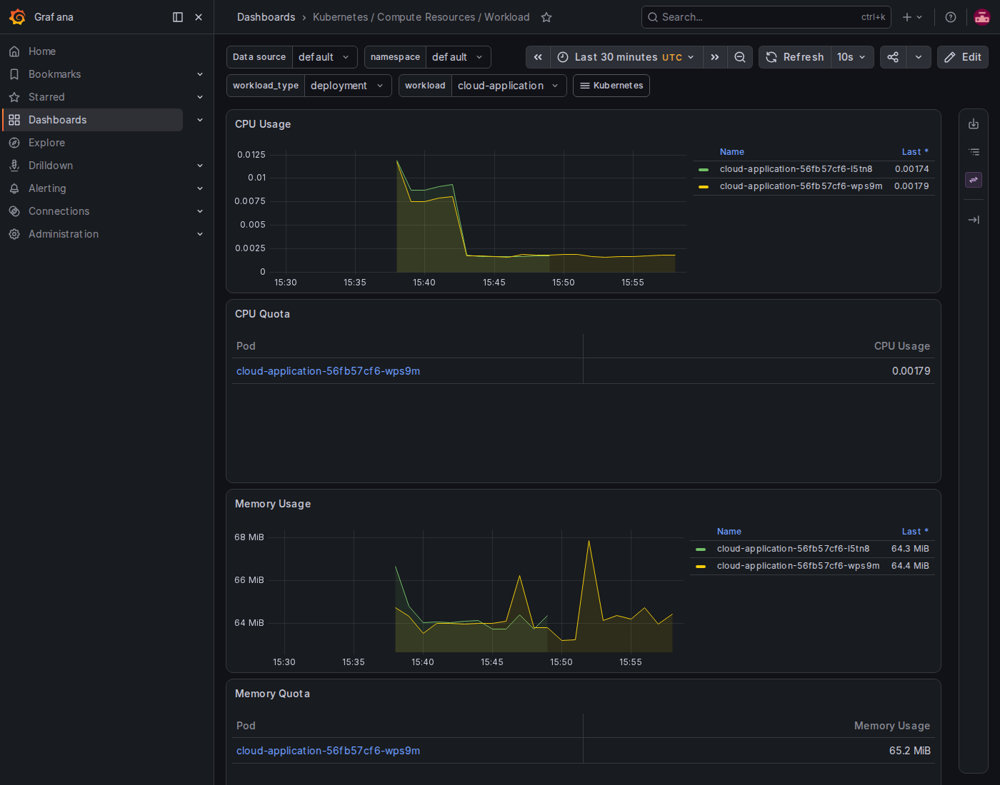
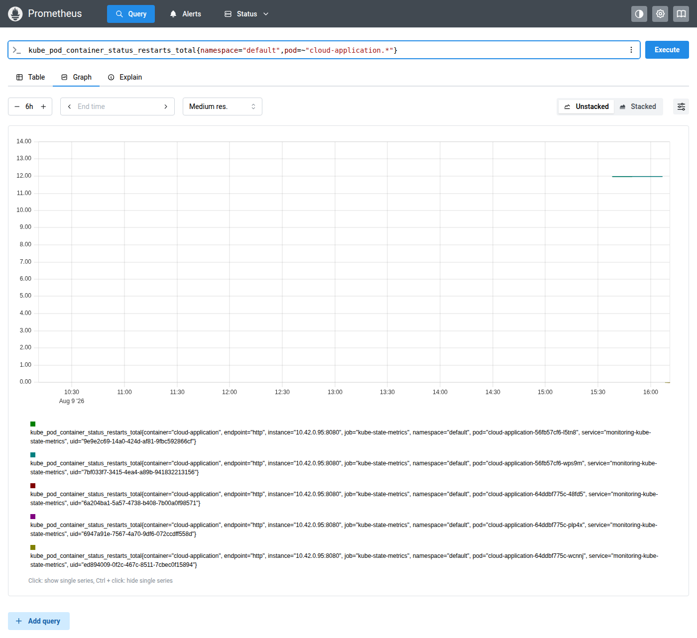

# Evidências — Competência 5 (Observabilidade e Resiliência)

Execução de **09/08/2026**. O código de observabilidade (logs JSON, `/health`, `/stats`,
`/metrics`) já vinha pronto desde a Competência 3/4 — esta etapa foi 100% operacional:
colocar Prometheus e Grafana no ar e comprovar a auto-recuperação do Kubernetes.

**Ambiente:**

| Recurso | Valor |
|---|---|
| Cluster K3s | VM `201.23.86.100`, zona `br-se1-a` |
| Instância DBaaS | `move-tech-db` — PostgreSQL 17, IP privado `172.18.2.20` |
| Prometheus | Helm chart `kube-prometheus-stack`, namespace `monitoring`, `http://201.23.86.100:9090` |
| Grafana | mesma stack, `http://201.23.86.100:3000` |
| Commit | `7379ac1` — `k8s/servicemonitor.yaml` |

---

## 1. Logs estruturados

Nem todo log do pod sai em JSON — só o que passa pelo logger da aplicação
(`app.main`). Os logs de acesso do Uvicorn usam o formatter próprio dele:

```console
$ kubectl logs -l app=cloud-application --tail=5
INFO:     10.42.0.1:40292 - "GET /health HTTP/1.1" 200 OK          # uvicorn.access (texto)
{"level": "INFO", "message": "{\"event\": \"order_created\", \"order_id\": \"4e928ee2-...\", \"customer\": \"teste-obs-comp5\"}", "logger": "app.main"}
```

Filtrando só os eventos de negócio:

```console
$ kubectl logs -l app=cloud-application | grep '^{' | jq -c 'select(.message | contains("order_created"))'
{"level":"INFO","message":"{\"event\": \"order_created\", ...}","logger":"app.main"}
```

## 2. `/health`, `/stats`, `/metrics` em produção

```console
$ curl http://201.23.86.100/health
{"status":"ok","database":"ok"}

$ curl http://201.23.86.100/stats
{"orders":{"total":3,"open":3,"cancelled":0},"items":{"total":1}}

$ curl http://201.23.86.100/metrics
# HELP http_requests_total Total number of requests by method, status and handler.
# TYPE http_requests_total counter
http_requests_total{handler="/health",method="GET",status="2xx"} 32.0
...
# HELP http_request_duration_highr_seconds Latency with many buckets ...
http_request_duration_highr_seconds_bucket{le="0.01"} 30.0
...
```

## 3. Prometheus + Grafana instalados via Helm

```console
$ kubectl get pods -n monitoring
NAME                                                   READY   STATUS    RESTARTS   AGE
monitoring-grafana-5668c448c5-whfsq                    3/3     Running   4          28m
monitoring-kube-prometheus-operator-55f6c7d9-jfgnp     1/1     Running   1          43m
monitoring-kube-state-metrics-5854769b78-v4x5l         1/1     Running   1          43m
monitoring-prometheus-node-exporter-5zzvf              1/1     Running   1          43m
prometheus-monitoring-kube-prometheus-prometheus-0     2/2     Running   0          22m

$ kubectl get svc -n monitoring
NAME                                     TYPE           EXTERNAL-IP     PORT(S)
monitoring-grafana                       LoadBalancer   201.23.86.100   3000:30357/TCP
monitoring-kube-prometheus-prometheus    LoadBalancer   201.23.86.100   9090:30759/TCP,8080:30205/TCP
```

> **Nota de dimensionamento:** a VM do cluster (2 vCPU / 2GB RAM, sem swap) não sobra
> quase nada depois do `k3s server` (~750MB sozinho). A instalação padrão do
> `kube-prometheus-stack` (com Alertmanager e sem limites de memória ajustados) levou a
> VM a thrashing (load average > 40, API do K3s inacessível). A stack final ficou:
> Alertmanager removido, `prometheus.prometheusSpec.retention=6h`, limites de memória
> reduzidos em Prometheus/Grafana/kube-state-metrics/operator, e a aplicação
> temporariamente reduzida para 1 réplica durante o trabalho de observabilidade.

## 4. ServiceMonitor conectando o Prometheus à aplicação

`k8s/servicemonitor.yaml` aplicado no cluster:

```console
$ kubectl apply -f k8s/servicemonitor.yaml
servicemonitor.monitoring.coreos.com/cloud-application created

$ curl -s http://201.23.86.100:9090/api/v1/targets | jq '.data.activeTargets[] | select(.labels.job=="cloud-application")'
{
  "health": "up",
  "scrapeUrl": "http://10.42.0.91:8000/metrics"
}
```

## 5. Grafana com dados reais da aplicação

Dashboard `Kubernetes / Compute Resources / Workload`, filtrado para
`namespace=default` / `workload=cloud-application`, mostrando CPU e memória dos pods:



A queda visível no gráfico de CPU por volta das 15:40–15:45 corresponde ao momento em
que a aplicação foi reduzida de 2 para 1 réplica (ajuste de recursos feito durante a
sessão, ver nota da seção 3).

## 6. Simular falha e observar a recuperação automática

Duas formas diferentes de auto-recuperação apareceram nesta sessão — vale registrar as
duas porque o Kubernetes usa mecanismos distintos para cada uma.

**a) `kubectl delete pod` — o ReplicaSet recria o pod (Etapa 9, deliberado)**

```console
$ kubectl get pods
NAME                                 READY   STATUS    RESTARTS   AGE
cloud-application-64ddbf775c-plp4x   1/1     Running   0          107s
cloud-application-64ddbf775c-wcnnj   1/1     Running   0          2m11s

$ kubectl delete pod cloud-application-64ddbf775c-plp4x
pod "cloud-application-64ddbf775c-plp4x" deleted

$ kubectl get pods   # 9s depois
NAME                                 READY   STATUS    RESTARTS   AGE
cloud-application-64ddbf775c-48fd5   0/1     Running   0          9s
cloud-application-64ddbf775c-wcnnj   1/1     Running   0          2m30s

$ kubectl get pods   # 17s depois — pronto
cloud-application-64ddbf775c-48fd5   1/1     Running   0          17s

$ kubectl describe deployment cloud-application
Conditions:
  Type           Status  Reason
  Progressing    True    NewReplicaSetAvailable
  Available      True    MinimumReplicasAvailable
NewReplicaSet:   cloud-application-64ddbf775c (2/2 replicas created)
```

O ReplicaSet nota que faltou 1 réplica pro total desejado (2) e cria um pod novo — não é
o *mesmo* pod voltando, é outro objeto do zero. Recuperado em 17s.

**b) Liveness probe reiniciando o container (achado real, não planejado)**

No início da sessão, a VM e o banco tinham sido desligados (crédito da MGC expirado).
Ao religar só a VM primeiro, o `/health` ficou tentando conectar num banco ainda
desligado — a conexão travou, a *liveness probe* estourou o timeout e o kubelet matou o
container repetidamente (`CrashLoopBackOff`), até o banco ser religado também:

```console
$ kubectl describe pod cloud-application-...
Warning  Unhealthy  kubelet  Liveness probe failed: context deadline exceeded
Normal   Killing    kubelet  Container failed liveness probe, will be restarted
```

Diferença importante: aqui é o **mesmo** pod, o container é que reinicia — por isso o
`RESTARTS` sobe (chegou a 12) em vez de aparecer um pod novo. Essa contagem ficou
registrada no Prometheus via `kube-state-metrics` mesmo depois do incidente resolvido:



| Mecanismo | Gatilho | O que muda |
|---|---|---|
| ReplicaSet recria pod | `kubectl delete pod`, node falha, etc. | Pod novo (nome/UID diferentes), `RESTARTS` do pod removido não conta |
| Liveness probe reinicia container | `/health` falha N vezes seguidas | Mesmo pod, `RESTARTS` incrementa |

[↑ Índice](#evidências--competência-5-observabilidade-e-resiliência)
