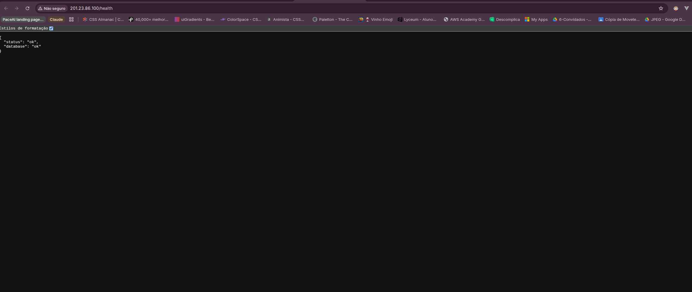
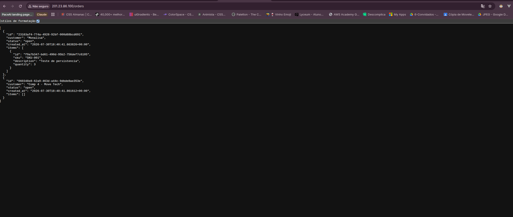
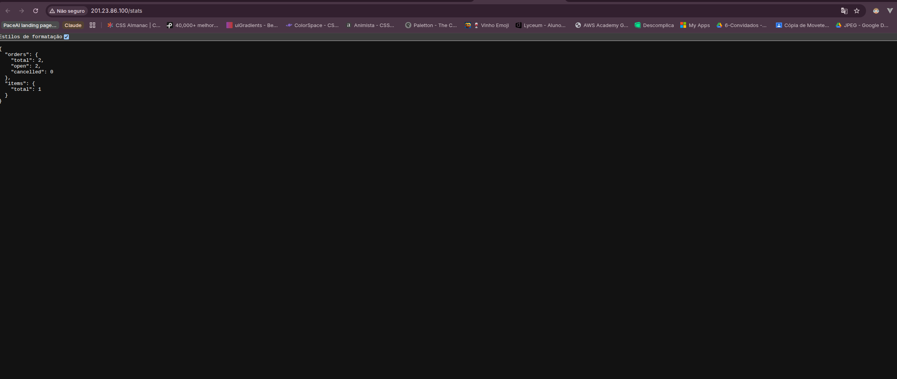
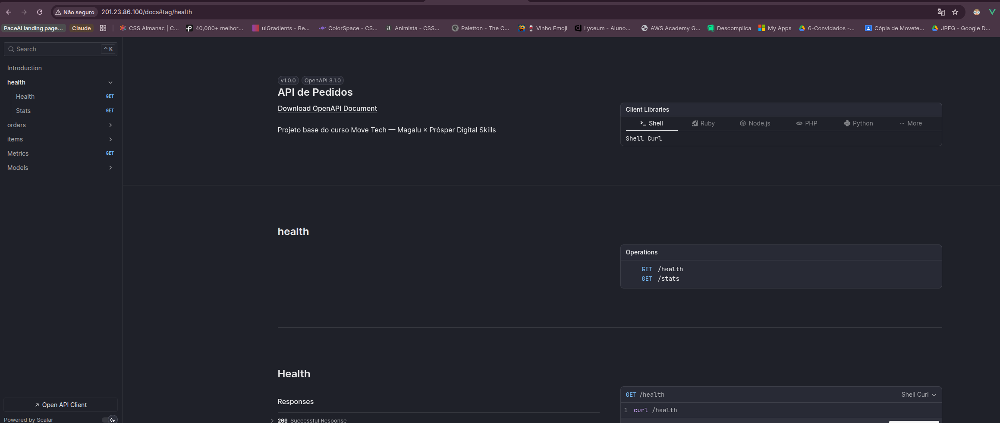
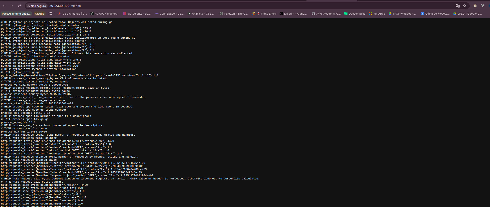

# Evidências — Competência 4 (Gestão de Dados e Persistência)

Execução de **30/07/2026**. Todas as saídas abaixo foram coletadas do ambiente real
(cluster K3s e PostgreSQL gerenciado na Magalu Cloud), não de execução local.

**Ambiente:**

| Recurso | Valor |
|---|---|
| Cluster K3s | VM `201.23.86.100` (privado `172.18.2.93`), zona `br-se1-a` |
| Instância DBaaS | `move-tech-db` — PostgreSQL 17, BV1-4-10, IP **privado** `172.18.2.20` |
| Banco | `orders` |
| Pipeline | run `30570742405` |
| Commits | `181e44e` (modelagem) · `d56acb3` (Secret + env) |

---

## 1. Pipeline verde

Todos os steps do workflow `Deploy`, incluindo a criação do Secret:

```
✓ Testes in 42s
✓ Build e deploy in 2m53s
  ✓ Login no Container Registry da MGC
  ✓ Build e push da imagem
  ✓ Configurar kubectl
  ✓ Criar Secret do banco
  ✓ Aplicar manifests
```

## 2. Secret criado no cluster pelo pipeline

```console
$ kubectl get secret db-secret
NAME        TYPE     DATA   AGE
db-secret   Opaque   1      4m34s
```

A credencial não existe em nenhum arquivo do repositório: ela sai do cofre do GitHub,
vira Secret no cluster e chega ao container como variável de ambiente.

## 3. Deployment consumindo o Secret

```console
$ kubectl get deployment cloud-application -o jsonpath='{...containers[0].image}'
container-registry.br-se1.magalu.cloud/mona-ecommerce-registry/cloud-application:d56acb3fddd3526f1ec4cdf8b5abfb1c13cbcfd8

$ kubectl get deployment cloud-application -o jsonpath='{...containers[0].env[*].name}'
DATABASE_URL
```

A imagem é referenciada pelo **SHA do commit**, não por `latest` — tag imutável é o que
faz a spec do Deployment mudar e o rollout de fato acontecer.

## 4. Aplicação conectada ao PostgreSQL

```console
$ curl http://201.23.86.100/health
{"status":"ok","database":"ok"}
```



---

## 5. Prova de persistência

O teste feito foi **mais rigoroso** que o pedido na Etapa 8. Em vez de disparar um
redeploy — que poderia, em tese, reaproveitar estado — os pods foram **destruídos**.

### 5.1 Dados gravados

```console
$ curl -X POST http://201.23.86.100/orders -d '{"customer":"Monalisa"}'
{"id":"23163af4-774a-4928-92bf-000d68bcd691", ...}

$ curl http://201.23.86.100/stats
{"orders":{"total":2,"open":2,"cancelled":0},"items":{"total":1}}
```

### 5.2 Pods destruídos

```console
$ kubectl get pods --no-headers
cloud-application-56fb57cf6-sw6dl   1/1   Running   0   8m28s
cloud-application-56fb57cf6-zk49f   1/1   Running   0   8m2s

$ kubectl delete pods --all
pod "cloud-application-56fb57cf6-sw6dl" deleted
pod "cloud-application-56fb57cf6-zk49f" deleted

$ kubectl rollout status deployment/cloud-application
deployment "cloud-application" successfully rolled out

$ kubectl get pods --no-headers
cloud-application-56fb57cf6-l5tn8   1/1   Running   0   14s
cloud-application-56fb57cf6-wps9m   1/1   Running   0   14s
```

Containers novos, **14 segundos de vida, disco zerado**.

### 5.3 Dados intactos

```console
$ curl http://201.23.86.100/orders
[{"id":"23163af4-774a-4928-92bf-000d68bcd691","customer":"Monalisa","status":"open",
  "created_at":"2026-07-30T18:40:41.663826+00:00",
  "items":[{"id":"f9a7b347-bd61-490d-95b2-756def7c6105","sku":"SKU-001",
            "description":"Teste de persistencia","quantity":3}]},
 {"id":"060348e8-62a9-463d-a44c-9dbde8ae353e","customer":"Comp 4 - Move Tech", ...}]
```



**Mesmos UUIDs, mesmos timestamps, item aninhado intacto** — gravados por containers que
não existem mais. Se o estado estivesse no SQLite dentro do pod, teria sido destruído junto.

O sufixo `+00:00` no `created_at` mostra o `TIMESTAMPTZ` do PostgreSQL: o SQLite não possui
tipo de data e armazenava o valor como texto.



---

## 6. Documentação da API



## 7. Métricas — os probes em ação

```
http_requests_total{handler="/health",method="GET",status="2xx"} 44.0
http_requests_total{handler="/orders",method="GET",status="2xx"}  1.0
```

As 44 chamadas a `/health` não vieram de usuários: são os **probes do Kubernetes**
(`readiness` a cada 10s e `liveness` a cada 20s, em 2 réplicas). É a confirmação, em
número, de que o cluster monitora a aplicação de forma autônoma.



---

## Checklist da competência

- [x] `docs/data-model.md` criado e commitado
- [x] Instância PostgreSQL criada e acessível no DBaaS da MGC
- [x] 5 secrets configurados no GitHub Actions (incluindo `DATABASE_URL`)
- [x] Pipeline executa com sucesso
- [x] Aplicação responde em `/health` com `{"status":"ok","database":"ok"}`
- [x] Dados persistem após redeploy
